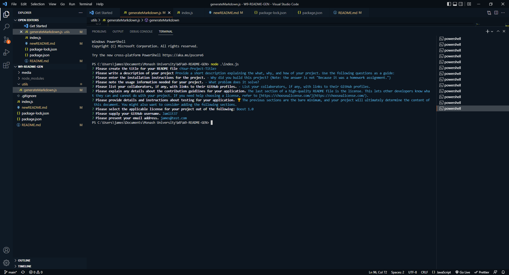
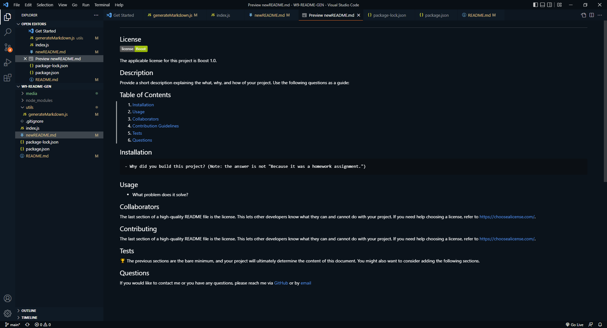
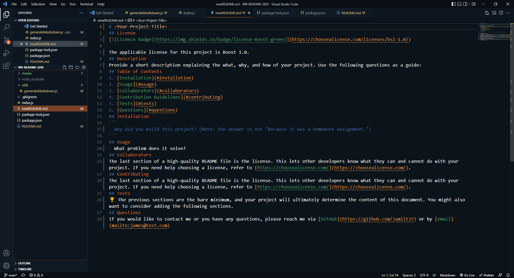

# 09 Node.js Challenge: Professional README Generator
## Description
The task was to create a command-line application that dynamically generates a professional README.md file from a user's input using the Inquirer package. Initialisation occurs on node index.js. 

## Screenshots of Application

## Video link
https://drive.google.com/file/d/16iHUozY9obbDIwvuMU3i99vUhMXCtFLW/view

## GitHub
https://github.com/Jamlit37/W9-README-GEN

